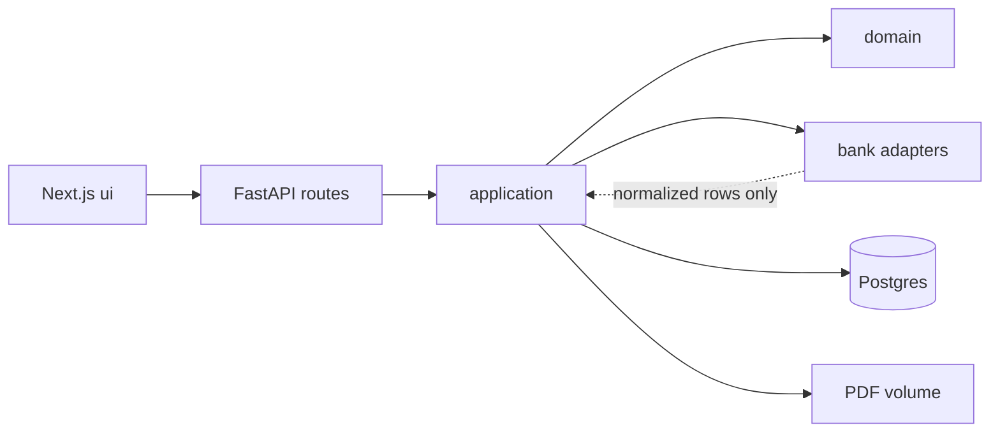
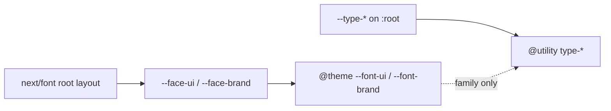
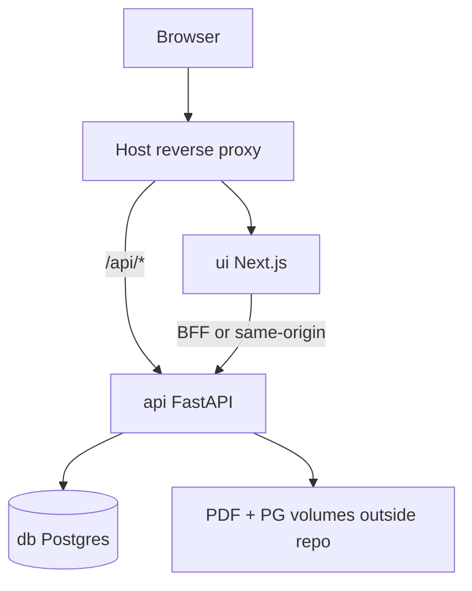

# Architecture Spine — finance-helper

## Design Paradigm

**Hexagonal / ports-and-adapters.** Domain (users, lists, membership, cards, dedup identity, import-session/batch commit, settle math, FX application) has no imports from Next.js, FastAPI routing, SQLAlchemy sessions, or PDF libraries. Driving adapters: bank parsers (`pdfplumber`), BCCR client, SMTP, Postgres repositories. Driven adapters: HTTP API (FastAPI), browser UI (Next.js).

Ingest is a **pipeline inside the application ring**, not the top-level paradigm: detect → split → parse → normalize → stage (Import Session) → review → commit (Import Batch).

```text
api/
  domain/           # pure rules; no framework/PDF imports
  application/      # use-cases / ports
  adapters/
    bank/           # one package per bank/product (+ Promerica stub)
    persistence/    # SQLAlchemy repos, Alembic
    fx/             # BCCR
    email/          # SMTP
  api/              # FastAPI routes, Pydantic DTOs, auth cookie edge
ui/                 # Next.js App Router standalone — Warm Balance; calls HTTP only
```

## Invariants & Rules

### AD-1 — Dependency shortlist [ADOPTED]

- **Binds:** all modules in `api/`, `ui/`
- **Prevents:** Second truth for dedup/ACL (Next→DB); parser/UI tangles; bank adapters calling each other or skipping review
- **Rule:**
  - **Allowed:** `ui` → HTTP API only; application → domain; bank adapters → return normalized rows to application; persistence adapters → Postgres; FX/email adapters → external systems
  - **Forbidden:** `ui` → Postgres/SQLAlchemy/parsers; bank adapter → commit/lists/membership; adapter ↔ adapter; domain → FastAPI/Next/pdfplumber/SQLAlchemy



### AD-2 — Process topology [ADOPTED]

- **Binds:** deploy, ingest, NFR interactive review
- **Prevents:** Unnecessary Redis/worker in v1; overnight-batch mental model
- **Rule:** Compose services are exactly **`db`**, **`api`**, **`ui`** (+ host Traefik/Caddy-class reverse proxy). Detect/split/parse run **in-process** on `api` during the upload path. No job broker until measured NFR-12 pressure forces a worker.

### AD-3 — Durable state ownership [ADOPTED]

- **Binds:** persistence, uploads, quarantine, import sessions
- **Prevents:** Split brains (S3 + DB + files with unclear owners); PDF bytes in git; retaining statement PDFs after SQL already holds the ledger
- **Rule:** PostgreSQL is the only durable store for users, lists, cards, import sessions/batches, candidate/committed rows, quarantine, FX snapshots/flags, aliases. Statement PDF bytes may live temporarily on an **operator volume outside the repo**; Postgres stores path references only while the file is needed (not `bytea`, not object storage in v1). **After a statement is parsed correctly and its Import Batch commits successfully with no unresolved quarantine, delete the PDF file and clear its path reference** — the ledger in SQL is the source of truth. Retain the PDF (and path) only while review/comparison or unresolved quarantine still needs the source document; clear on dismiss and when quarantine is fully resolved.

### AD-4 — Import Session and Batch [ADOPTED]

- **Binds:** FR upload/review/commit/discard/rollback
- **Prevents:** Ad-hoc staging; unclear atomic rollback; partial-commit vs batch fights
- **Rule:**
  - **Import Session** = staging aggregate for one upload (statements + candidate rows). Review mutates the session. Discard drops only **uncommitted** session state.
  - **Import Batch** = journaled commit unit. v1 batch boundary = **one Statement’s accept/commit** (stable `batch_id` per statement). Multi-statement uploads may produce multiple batches under one session.
  - Rollback (FR-30) targets a `batch_id` atomically. Nothing reaches settle math until its batch commits.

### AD-5 — Money representation [ADOPTED]

- **Binds:** all amount fields, settle math, FX outputs
- **Prevents:** Float drift across TS/Python
- **Rule:** Postgres `NUMERIC` is source of truth; Python domain uses `Decimal`. Never `float` for money. Currency is an explicit ISO 4217 code beside the amount.

### AD-6 — Split remainder [ADOPTED]

- **Binds:** percentage splits that sum to 100%
- **Prevents:** Non-deterministic leftover subunit; per-user preference forks
- **Rule:** After floor-division of shares, any leftover minor unit goes to the **list creator**.

### AD-7 — FX conversion [ADOPTED]

- **Binds:** FR-40 CRC conversion for settle views
- **Prevents:** Silent wrong rates; per-builder BCCR vs other sources; mixed write-time/read-time CRC
- **Rule:** Authoritative source is **BCCR** daily rate for the purchase/statement date. If missing, use the **nearest prior** published BCCR date and **flag** rate-fallback. **No FX override in v1.** At commit of a non-CRC line, domain **materializes** `amount_crc`, `fx_rate`, `fx_rate_date`, `fx_fallback` beside the original `(amount, currency)`. Settle-up reads materialized CRC — it does not re-call BCCR per view.

### AD-8 — Auth session delivery [ADOPTED]

- **Binds:** FR-1–4, NFR auth; `ui`↔`api` cookies
- **Prevents:** XSS-exfiltratable Bearer tokens in `localStorage`
- **Rule:** Email+password with password reset via SMTP. Browser session is an **httpOnly Secure** cookie (JWT or opaque session id). Traffic is **same-origin** via reverse proxy and/or Next Route Handler BFF (`/api` → `api`). Bearer-in-client-storage is forbidden. Library may be fastapi-users or custom argon2 + signed cookies.
- **Addendum (Epic 1.5):** Single-use email tokens (password reset, email verify, and future invites) MUST hash at rest, enforce TTL, and **re-check `expires_at` on claim** — a successful claim MUST NOT succeed solely because a row matched. SMTP send is fail-loud (no silent “sent”). Prefer one shared claim helper over copy-paste per token type.
- **Living map:** [auth-mail-interaction-map.md](./auth-mail-interaction-map.md) (session/BFF, reset, verify, SMTP — Story 1.5.2)
- **Invite verify-gate contract:** [invite-verify-gate-contract.md](../../../implementation-artifacts/invite-verify-gate-contract.md) (Story 1.5.3 — Ensure at accept, not send)

### AD-9 — Individual review gestures [ADOPTED]

- **Binds:** FR-17–18; EXPERIENCE J1 (supersedes soft PRD swipe OPEN)
- **Prevents:** Desktop-only button apps that skip phone swipe; swipe theatre on desktop; divergent L/R/D mappings across stories
- **Rule:** Phone Individual review **must** implement true swipe commits; desktop **must** use buttons as primary. Vectors: **right → chosen list** (after list picker), **left → configurable default list**, **down → skip**. Same three outcomes on desktop as labeled buttons. List picker precedes high-intent accept. Accessible non-gesture equivalents required (WCAG 2.2 AA product floor).

### AD-10 — Conflict match window and resolution [ADOPTED]

- **Binds:** FR-22 same-price; FR-28 hand-fixed↔re-parse
- **Prevents:** UI inventing match candidates; inconsistent windows; easy double-count via peer keep-both; divergent rules between conflict kinds
- **Rule:** Server computes candidates against **durable unresolved manual ledger entries** (not session-only buffers). Equal amount+currency on related lists. Window is **list-configurable**; product default **±3 calendar days** from the parsed row’s posted date. Resolution UI is shared: default **pick Manual or Parsed** (one survivor); escape **“Not the same expense”** keeps both only after confirm that warns of double-count / overpay risk; escape must be harder than the survivor pick (not an equal third peer action).

### AD-11 — CI fixtures [ADOPTED]

- **Binds:** adapter contract tests; release gate
- **Prevents:** Real PII in repo; CI that requires the operator machine
- **Rule:** CI uses **synthetic PDFs with known geometry** + golden expected rows. Real statements stay at a configured path outside the repo (operator-only tier).

### AD-12 — Visual / UX companion authority [ADOPTED]

- **Binds:** `ui` styling, IA, interaction choreography
- **Prevents:** shadcn/template defaults becoming brand; inventing IA that contradicts UX spines
- **Rule:** `DESIGN.md` + `EXPERIENCE.md` are **binding companions**. Warm Balance tokens / Soft-Ledger / IA / interaction primitives own product behavior and look. Architecture chooses stack only. Component kits may supply unstyled primitives only.
- **Addendum (Epic 3.5):** Delivery stack is Tailwind + SCSS (AD-23). AD-12 still owns appearance — utilities/theme mapping must express Warm Balance / Soft-Ledger, not replace them with kit defaults. Type *faces and roles* stay in DESIGN.md; type *delivery* is AD-24. If DESIGN.md defines a **component** (`balance-strip`, `top-nav`, `tab-bar`, `receipt-row`, `section-label`, `hint`, `button-primary`, …), UI MUST use the matching Soft-Ledger primitive — do not re-implement that chrome with raw `type-*` classes.

### AD-13 — Story branch naming [ADOPTED]

- **Binds:** all implementation work toward main
- **Prevents:** Shared long-lived branches; unclear epic/story ownership in git history
- **Rule:** One user story per branch named `<type>/<epic>/<us-id>` where `type` ∈ `feat` | `fix` | `chore` | `docs` | `refactor` | `test` | `ci`. Merge to `main` only via PR after CI (AD-15).

### AD-14 — Semantic versioning [ADOPTED]

- **Binds:** releases of the self-hosted Compose app
- **Prevents:** Independent drifting version numbers for `api` vs `ui` as the product version
- **Rule:** The deployable app is versioned as **one** SemVer (`vMAJOR.MINOR.PATCH`). Tags mark releases of the whole Compose system, not separate package lines.

### AD-15 — TDD and CI merge gate [ADOPTED]

- **Binds:** development process; PRs into `main`
- **Prevents:** Untested parser/domain landings; merge without automated checks
- **Rule:**
  - **Parsers and domain:** red → green TDD (failing test first, then implementation).
  - **UI:** test-after allowed, with an explicit coverage floor set at scaffold (must not go to zero).
  - **CI required before merge to `main`:** lint; `api` pytest including synthetic fixture goldens (AD-11); `ui` typecheck + lint; critical `ui` tests. Full Playwright e2e on every PR is **not** a v1 merge requirement.

### AD-16 — CanonicalLine contract [ADOPTED]

- **Binds:** adapters, staging, commit, ledger
- **Prevents:** JSON-blob staging vs typed commit mismatch
- **Rule:** Staging and ledger share one **CanonicalLine** field set: at least `posted_date` (ISO-8601), signed `amount`, ISO 4217 `currency`, `product_id`, `line_type`, `external_ref` when provided, `normalized_description`, `provenance` (`parser` | `hand`). `CANDIDATE_ROW` = CanonicalLine + session review fields only. Adapters MUST emit CanonicalLine; persistence MUST NOT store adapter-private shapes as the row body.

### AD-17 — Quarantine ownership [ADOPTED]

- **Binds:** FR-25–27, FR-43 incomplete disclosure
- **Prevents:** Session-only quarantine that vanish after commit while settle needs them
- **Rule:** Pre-commit unresolved rows live on the Import Session. After **accept-with-quarantine**, unresolved rows become **durable** entities owned by the committed **Statement** (statement marked incomplete). Hand-fix (FR-27) mutates those durable rows. Balance views MUST disclose incompleteness when any statement in the period has unresolved quarantine.

### AD-18 — Dedup identity authority [ADOPTED]

- **Binds:** FR-20, FR-34; adapter normalize; commit
- **Prevents:** Adapter-hashed keys vs domain fallback tuple divergence
- **Rule:** **Domain alone** computes canonical identity at commit. Primary: stable bank `external_ref` when adapter marks ref quality stable. Fallback: `(product_id, posted_date, currency, amount, normalized_description, line_type, statement_period_id)`. Adapters MUST NOT emit authoritative dedup keys (optional `ref_quality` hint only).

### AD-19 — List authorization [ADOPTED]

- **Binds:** all list-scoped reads/writes; invites
- **Prevents:** Implicit global read; two ACL schemes
- **Rule:** Users are peers. A user may read/write a list’s ledger and import into it only if they hold **membership** on that list (personal list auto-created at signup). Invite acceptance creates membership. No privileged product admin role in v1.
- **Addendum (Epic 1.5):** Membership checks are enforced in **one** application-layer path (not ad-hoc per route). Epic 1.5 delivers the enforcement **sketch**; Epic 2 implements it for list reads/writes and invites. Do not invent a second ACL scheme in the UI. Living contract: [membership-acl-enforcement-sketch.md](./membership-acl-enforcement-sketch.md).

### AD-20 — Card registration [ADOPTED]

- **Binds:** FR-11, FR-16, FR-37 IBAN/card label
- **Prevents:** Orphan product_ids; competing card tables in UI vs API
- **Rule:** Cards are first-class durable entities owned by a user (label + routing identifiers such as IBAN). Parsed IBANs match existing cards; unknown IBANs block import progress via registration (label chosen by user) before commit of that statement. Card labels are the human import identifiers.

### AD-21 — v1 settle vs settlement payments [ADOPTED]

- **Binds:** FR-39–45; PRD v2 settlement OPEN
- **Prevents:** Double-counting statement transfers vs recorded payments; inventing a payment ledger in v1
- **Rule:** v1 settle-up is **computed shares only** (no recording of actual payments). Taxonomy MUST include a line type for inter-member transfers so such rows can be stored without feeding settle allocations. Recording/reconciling settlement payments is **out of v1**.

### AD-22 — Operational envelope [ADOPTED]

- **Binds:** deploy, environments, ops
- **Prevents:** Silent drift on backup/migrate/health
- **Rule:** Environments = **local** and **homelab prod** via Compose overlays sharing the same service graph. Alembic migrations run on `api` startup (or explicit one-shot) against the external PG volume — never recreate volume for schema. `api` and `ui` expose `/health`. Postgres + PDF volumes backed up by operator filesystem/volume snapshot. Secrets via Compose secrets/env outside repo. Observability floor: structured app logs + healthchecks (no third-party APM required in v1).

### AD-23 — UI styling delivery [ADOPTED]

- **Binds:** `ui` style authoring (Epic 3.5+)
- **Prevents:** CSS Modules sprawl; kit theme inheritance; dual styling stacks into Epic 4
- **Rule:** Prefer **Tailwind utilities co-located on components**. Use **SCSS modules (`*.module.scss`)** only for custom styles that utilities cannot express cleanly. Warm Balance / Soft-Ledger **color** tokens remain authoritative via CSS variables and/or Tailwind `@theme` mapping (AD-12 still binds look). **Type metrics** are not an “and/or”: `--type-*` live on `:root` only; `@theme` maps families only (AD-24). **Forbidden:** new `*.module.css`; shipping starter/kit default palettes; re-picking DESIGN.md hexes inside feature work.
- **Sprint change:** `_bmad-output/planning-artifacts/sprint-change-proposal-2026-08-10.md`

### AD-24 — Type delivery [ADOPTED]

- **Binds:** all `ui` typography; DESIGN.md type roles; Tailwind `@theme` / `@utility`; Soft-Ledger primitives
- **Prevents:** Per-file family strings; inline `fontFamily` / `--type-*` style bags; HTML-tag→face maps that fight DESIGN.md (list title is UI face; money/wordmark are brand face); `next/font` and `@theme` sharing one CSS variable; a second font loader; `font-ui`/`font-sans`+local metrics as a shadow type system; a second role catalog; a generic type wrapper; extending grandfathered brownfield type
- **Rule:**
  - **Load once.** Root layout `next/font` is the only font loader. Loaded-face vars are `--face-ui` and `--face-brand` only — never `--font-ui` / `--font-brand`. Forbidden: `@import` fonts, `@font-face`, extra font `<link>`, `FontFace` API, per-route `next/font`, family-name literals in TSX or SCSS. Subset/weight/display (including `latin-ext` for ES) edit the root loader only. Rename live layout `--font-ui` / `--font-brand` in the **same** change that adds the `@theme` bridge.
  - **Bridge.** The same `@theme` surface that owns Warm Balance colors maps `--font-ui` / `--font-brand` (product names) to `var(--face-ui)` / `var(--face-brand)` plus DESIGN.md fallbacks. That generates `font-ui` / `font-brand`. Do **not** alias `font-sans` / `font-serif` / `font-mono` to product faces. `@theme` maps **families only**.
  - **One registry.** `--type-*` tokens live on `:root` only (not inside `@theme`). `@utility type-*` references those vars — never DESIGN.md rem/weight literals. Each DESIGN.md typography key has exactly one matching `type-*` class. Snapshot (not a competing catalog): `brand`, `list-title`, `strip-who`, `strip-amount`, `section-label`, `body`, `meta`, `amount-inline`, `button`, `tab`. Do not invent or skip roles. New roles require a DESIGN.md change first (AD-12), then the matching token + utility.
  - **Consume.** `type-*` applies **every typographic note** on that DESIGN.md role: face, size, weight, tracking, line-height, `text-transform`, `font-variant-numeric`. Color stays out (AD-12). Any amount (strip, row, FX parenthetical, split total, disclosure figure) uses `type-amount-inline` or `type-strip-amount` — never `type-meta` / `type-body` for the numeric run. Role weight is the token (550 stays 550; do not round to Tailwind’s 100-step scale on the node). If DESIGN.md defines a component, use the Soft-Ledger primitive (AD-12 addendum). `type-*` on a raw node only when **no** primitive exists for that component. No product `<Text>` / `<Copy>` wrapper. Prop form is allowed only on an existing Soft-Ledger component; the value is the DESIGN.md role key. Feature TSX otherwise adds one `type-*` class and does not set fonts. SCSS is layout/spacing only — no `font-family` and no role metrics.
  - **Tag defaults.** `body` applies the **`body` role** (not merely the UI face). Form controls `font: inherit` unless a money or button role applies. Field values use `body`; hints/labels use `meta`. Tags are **not** the type API — do not map `h1`→Petrona / `p`→Manrope.
  - **Grandfather.** Existing inline `fontFamily`, `--type-*` style bags, and SCSS `font-family` may remain until the backfill chore. Do **not** add or extend that pattern. Any **new or edited** typography uses `type-*` (or a Soft-Ledger prop). SCSS touched for layout must not gain new font/size/weight/tracking/line-height rules. Fallback stack is DESIGN.md only (`Times New Roman` / `system-ui`) — Georgia is drift.
  - **Forbidden:** `font-sans` / `font-serif` / `font-mono` (and any `font-*` family utility) on feature TSX or primitives except inside `@utility type-*` or the root `body` rule; composing `type-*` with local `text-*` / `font-*` (weight) / `tracking-*` / `leading-*` or arbitrary metric classes; inline `fontFamily` or `--type-*` style bags; inventing Inter/Roboto or any face not in DESIGN.md.



### AD-25 — Section header contract [ADOPTED]

- **Binds:** bank adapters' `parse()` step; section/line-type mapping (extends AD-16)
- **Prevents:** each adapter reimplementing its own title/column-header state machine; a stray boilerplate or column-label line between a section title and its data rows being misread as a data row or as an unmapped section
- **Rule:** Adapters declare sections as a `SectionSpec` list (`domain/statement_layout.py`): `title` (the printed section title line), `line_type`, `policy` (`SECTION_POLICIES`), and an optional `column_header` (the printed column sub-header line, for banks that print one — real statements print a two-level header: section title, then a column sub-header, e.g. "NO. REFERENCIA FECHA CONCEPTO DÉBITOS CRÉDITOS"). A shared `SectionCursor` walks an adapter's extracted lines against that declared list — recognizing a title, silently consuming exactly one immediately-following declared `column_header` without ending the "just saw a header" state, then classifying subsequent lines as data / ignored / unmapped per the active section's policy. Adapters MUST declare sections via `SectionSpec`, not a private title→policy dict; the header state machine lives once in `SectionCursor`, not reimplemented per adapter.

### AD-26 — Per-product date-format contract [ADOPTED]

- **Binds:** bank adapters' row-level date parsing (extends AD-16's `posted_date`)
- **Prevents:** locale-dependent month parsing (`datetime`/`strptime`'s `%b` resolves against the system locale, not guaranteed `es_CR`); a hand-rolled date parser per adapter/product; a fabricated year silently misdating a row
- **Rule:** Each adapter declares a `date_format` string (e.g. `"%d-%b-%y"` for BAC credit's `DD-MMM-YY`, `"%b/%d"` for BAC debit's `MMM/DD`) — its own token vocabulary, resolved by a shared `domain/statement_dates.py` tokenizer against a fixed Spanish-month table, never against `datetime`'s locale machinery. When a declared format has no year token, the adapter supplies the source PDF's `/CreationDate` metadata (read once per statement chunk, not per row) as `reference_date`; the shared parser assigns each row's `(month, day)` the nearest year at or before `reference_date` — try `reference_date.year`; if that combination would fall after `reference_date`, roll back one year. Adapters MUST NOT infer years via ad-hoc per-row logic or a majority-vote pass over the statement; nearest-prior-to-`reference_date` is the one source of truth (mirrors AD-7's FX nearest-prior-date fallback).

### AD-27 — Statement-boundary detection [ADOPTED]

- **Binds:** bank adapters' `split()` step (extends AD-16's multi-statement split, NFR-12)
- **Prevents:** a repeating page marker (bank name/letterhead printed on every page) being mistaken for a statement boundary; each adapter reimplementing its own boundary-detection fallback chain
- **Rule:** Statement boundaries are detected via one shared priority chain (`domain/statement_layout.py`), strongest evidence first: (1) a printed page counter (e.g. "Página X de Y") resetting to 1 — real evidence of a new statement starting, not just a repeating running header; (2) a repeating per-statement marker line, used only when no page counter is found anywhere in the document (weaker signal — cannot distinguish a per-statement marker from a running page title on a single long statement); (3) no evidence found → assume one statement. `split()` implementations MUST call the shared detector rather than hand-rolling their own boundary heuristic; which method fired is retained (not silently discarded) for adapter test/debug visibility.

## Consistency Conventions

| Concern | Convention |
| --- | --- |
| Naming | Generic product vocabulary — no personal names in code/schema/fixtures; banks/products are adapter ids |
| Dates | Posted/cycle dates normalized to ISO-8601 calendar dates in `America/Costa_Rica` |
| IDs | Stable UUIDs for users, lists, cards, sessions, batches, committed rows |
| Money | `NUMERIC` + currency code; domain `Decimal`; see AD-5 |
| Canonical rows | AD-16 field set everywhere staging/ledger touch |
| Errors | Fail-loud on unknown/ambiguous detect and must-parse failure; structured JSON API errors; generic auth failures |
| Config | Secrets/SMTP/paths outside repo |
| Auth cookies | Same-site first-party; Secure in HTTPS |
| Auth email tokens | Hash at rest; TTL; claim re-checks `expires_at`; shared claim helper (AD-8 addendum) |
| i18n | EN + ES from v1; keys in `ui`; preference remembered on account (Account menu); first visit from browser |
| Appearance | Light / Dark / System from Account menu; remembered on account; default System (OS/browser); Warm Balance token sets from DESIGN.md |
| UI styling | Tailwind utilities co-located; SCSS modules for custom only — AD-23 |
| Type | `next/font` → `--face-*` → `@theme font-ui`/`font-brand` → `@utility type-*` from `:root --type-*`; `body` gets body role — AD-24 |
| Logging | No raw statement PII at info; correlate by session/statement/batch ids |
| Branches | `<type>/<epic>/<us-id>` — AD-13 |
| Versioning | Single app SemVer tag — AD-14 |
| Commits | Prefer Conventional Commits aligned with branch `type` |
| UX | EXPERIENCE/DESIGN bind IA/visual — AD-12 |

## Stack

Versions verified 2026-08-03 (`stack-options.md` + gate re-check). Type-delivery APIs (`next/font`, Tailwind v4 `@theme --font-*`, `@utility`) re-checked 2026-08-14 against Tailwind docs + live `ui/app/layout.tsx` — no new pins. Code owns exact pins once scaffolding exists.

| Name | Version |
| --- | --- |
| Python (`api`) | 3.12+ |
| FastAPI | 0.141.x |
| Uvicorn | 0.52.x |
| Pydantic | 2.13.x |
| SQLAlchemy | 2.0.x |
| Alembic | 1.18.x |
| psycopg | 3.3.x |
| pdfplumber | 0.11.x |
| aiosmtplib | ≥5.1.2 (CVE-2026-55558 floor) |
| pytest | 9.x |
| Next.js (`ui`) | 16.2.x (`output: 'standalone'`) |
| React (via Next) | 19.2.x |
| Tailwind CSS (`ui`) | 4.x (Warm Balance `@theme` / CSS-var bridge — AD-12, AD-23, AD-24) |
| Sass (`ui`) | 1.x (custom styles / `*.module.scss` only — AD-23) |
| react-pdf | 10.4.x (owns bundled `pdfjs-dist` — do not pin a conflicting standalone pdfjs) |
| @use-gesture/react | 10.3.x |
| PostgreSQL | 16.x (`postgres:16`) |
| Docker Compose | `db` + `api` + `ui` (+ host reverse proxy) |

Explicit rejects: Streamlit/Gradio/NiceGUI/Reflex as primary UI; Node-primary API for v1; SQLModel-as-HTTP-shape; PyMuPDF default without license decision; Bearer tokens in `localStorage`; mixed FX write-time/read-time CRC.

## Structural Seed

```text
repo/
  api/
    domain/
    application/
    adapters/bank/
    adapters/persistence/
    adapters/fx/
    adapters/email/
    api/
    tests/fixtures/pdf/   # synthetic only
  ui/                     # Next.js standalone
  docker-compose.yml
  docker-compose.prod.yml
  .env.example
  .github/workflows/ci.yml
```



### Core entities (names + relationships only)

```mermaid
erDiagram
  USER ||--o{ LIST_MEMBERSHIP : has
  LIST ||--o{ LIST_MEMBERSHIP : has
  USER ||--o{ CARD : owns
  LIST ||--o{ IMPORT_SESSION : receives
  USER ||--o{ IMPORT_SESSION : uploads
  IMPORT_SESSION ||--|{ STATEMENT : contains
  STATEMENT ||--|{ CANDIDATE_ROW : stages
  STATEMENT ||--o|{ IMPORT_BATCH : commits_as
  IMPORT_BATCH ||--o{ LEDGER_ENTRY : writes
  STATEMENT ||--o{ QUARANTINE_ROW : incomplete
  LIST ||--o{ LEDGER_ENTRY : holds
  CARD ||--o{ STATEMENT : identifies
```

## Capability → Architecture Map

| Capability / Area | Lives in | Governed by |
| --- | --- | --- |
| Auth signup/signin/reset | `api` auth + SMTP; `ui` account | AD-8, AD-1, AD-22 — see [auth-mail-interaction-map.md](./auth-mail-interaction-map.md) |
| Lists, membership, splits, ACL | `domain` + persistence | AD-19, AD-5, AD-6 — see [membership-acl-enforcement-sketch.md](./membership-acl-enforcement-sketch.md) |
| Cards / IBAN registration | `domain` + persistence; `ui` interrupt | AD-20, AD-12 |
| Type / fonts | `ui` `@theme` + `@utility type-*`; Soft-Ledger primitives | AD-24, AD-12, AD-23 |
| Detect / split / parse / normalize | `adapters/bank/*` | Paradigm, AD-2, AD-11, AD-16, AD-25, AD-26, AD-27 |
| Import Session review | `application` + `ui` | AD-4, AD-9, AD-12 |
| Commit / dedup / batch rollback | `domain` + persistence | AD-4, AD-16, AD-18 |
| Quarantine + incomplete disclosure | `domain` + settle views | AD-17 |
| PDF failure comparison | `ui` react-pdf + PDF path | AD-3, AD-12 |
| Same-price conflicts | `application` match | AD-10 |
| Settle-up / simplify CRC | `domain` + materialized FX | AD-5, AD-6, AD-7, AD-21 |
| Invites email | SMTP adapter | AD-8, AD-19 |
| CI / branches / SemVer | repo tooling | AD-11, AD-13, AD-14, AD-15 |
| Operator deploy | Compose + volumes/proxy | AD-2, AD-3, AD-22 |

## Deferred

| Item | Why it can wait |
| --- | --- |
| fastapi-users vs custom cookie sessions | Both satisfy AD-8 |
| Redis / background worker | Only if in-process parse misses NFR-12 |
| Traefik vs Caddy vs other proxy | Same-origin cookie contract matters; brand does not |
| Operator real-PDF harness UX | Policy locked (AD-11) |
| Settlement payment recording / double-count flows | AD-21: out of v1; taxonomy stub only |
| User FX override | Out of v1 (AD-7) |
| CSV/HTML format adapters | Contract allows; v1 PDF only |
| ML categorization / trends | PRD out of v1 |
| Exact UI coverage floor % | Set at `ui` scaffold (AD-15) |
| Playwright e2e every PR | Optional later |
| SemVer bump automation tooling | Policy locked; tool at scaffold |
| BCCR API transport details (token/endpoint codes) | Source/behavior locked in AD-7; wire format is implementation spike |
| Payer field / absolute sub-amount split UX edge cases | Product rules in PRD; implement under AD-5/6/19 without new paradigm |
| Backfill existing `fontFamily` / `--type-*` bags / SCSS `font-family` onto `type-*` | Grandfather + do-not-extend is in AD-24; chore is the migration, not a second contract |
| `font-sans` / `font-serif` aliases for the same faces | Would create two names; product names only (AD-24) |
| `next/font` weight/subset/display pins | Single root loader; edit that file only (AD-24) — no second AD |
| Class-attribute / JSX prop order | House style — `project-context.md` / linter, never an AD |
