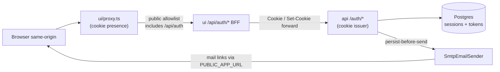

# Auth/mail interaction map (living)

**Owner:** update when auth/mail request paths change (story assignee). Spine keeps a discoverability link only.  
**Story:** 1.5.2 · **Governs:** AD-8 (+ Epic 1.5 addendum)  
**Not this doc:** Import Session (AD-4 PDF staging) — different “session” concept.

Companion process: [`story-close-overview-checklist.md`](../../../implementation-artifacts/story-close-overview-checklist.md)

---

## Overview

All browser hops (pages and `/api/auth/*`) still enter via `proxy.ts`. Auth BFF paths are on the **public allowlist** (presence check skipped), then the Route Handler runs.

**Cookie hop (sign-in / register):** Browser → `proxy.ts` → Next Route Handler → `fetch(API_INTERNAL_URL + /auth/…)` → FastAPI `_set_session_cookie` → BFF forwards `Set-Cookie` via `headers.getSetCookie()` when available, else falls back to the single `Set-Cookie` header string. **Api is the sole cookie issuer**; ui never mints `fh_session` (sign-out may only clear).

**Mail hop (reset / verify):** Application persists hashed token row → `EmailSender.send` → on SMTP failure, route rolls back and returns `503` (`smtp_*`) — never silent “sent”. Link host is `PUBLIC_APP_URL` (defaults to `http://localhost:3000` if unset — mis-set values yield broken email links, not a hard fail today).

---

## Invariants (AD-8 cheat sheet)

| Invariant | Status |
|-----------|--------|
| Session delivery | **As-built:** httpOnly cookie (`SESSION_COOKIE_NAME`, default `fh_session`); Secure/SameSite from env |
| Issuer | **As-built:** **api only** — BFF forwards `Set-Cookie` / `Cookie` |
| Forbidden | **As-built:** Bearer in `localStorage`; dual independent cookies; NextAuth / Nodemailer / UI SMTP |
| Auth errors | **As-built:** Generic — no email enumeration on sign-in or reset **request** ack |
| Email tokens (hash + TTL) | **As-built:** SHA-256 at rest; reset TTL 1h; verify TTL 24h |
| Email token claim | **Target (Story 1.5.1):** shared helper re-checks `expires_at` on claim — see below (not yet on every branch) |
| SMTP | **As-built:** Fail-loud (`SmtpConfigurationError` / `SmtpSendError`) |
| Hex | **As-built:** Domain has no FastAPI/SQLAlchemy/SMTP imports; ORM under `adapters/persistence`; mail under `adapters/email` |

**Claim truth (target / post-1.5.1):** `api/adapters/persistence/token_claim.py` → `claim_single_use_email_token` requires `id` + `used_at IS NULL` + `expires_at > now`. Invite copy-paste: `auth-email-token-claim-pattern.md` under `_bmad-output/implementation-artifacts/` — **pending until Story 1.5.1 merges** (file may 404 on branches that lack that story). Do **not** treat pre-1.5.1 “row match only” claim as the intended contract.

---

## 1. Session / BFF

### Request path

1. **Coarse UX:** `ui/proxy.ts` — if cookie **absent** and path not public → redirect `/sign-in?returnTo=…`. Does **not** bounce away from `/sign-in` when a stale cookie is present (loop prevention). Cookie **presence** alone is not auth.
2. **Fine auth (RSC):** `ui/lib/session.ts` `fetchSession` → `GET {API_INTERNAL_URL}/auth/session` with forwarded cookies. If cookie is present but revoked/expired/invalid → `fetchSession` returns null; layouts/pages must treat as signed-out (redirect `/sign-in`) — do not assume proxy presence ⇒ authenticated api.
3. **Register:** Browser `POST /api/auth/register` → api `POST /auth/register` → create user + personal list membership → revoke prior sessions → `create_session` → Set-Cookie. When `EMAIL_VERIFICATION_REQUIRED` is on, register may auto-send verify mail; SMTP failure rolls back the registration unit of work (fail-loud).
4. **Sign-in:** Browser `POST /api/auth/sign-in` → api `POST /auth/sign-in` → `SignInService` + argon2 → revoke prior opaque sessions → `create_session` → Set-Cookie.
5. **Sign-out:** BFF `POST /api/auth/sign-out` → api revokes row + clears cookie; BFF **always clears** browser cookie even if upstream fails.
6. **Protected api:** `require_authenticated_user` on `/auth/me`, `/auth/verify/request`, lists, etc.

### Key components

| Layer | Path |
|-------|------|
| Proxy | `ui/proxy.ts` |
| Session helper | `ui/lib/session.ts` |
| Auth redirect helper | `ui/components/RedirectIfAuthenticated.tsx` |
| BFF | `ui/app/api/auth/{register,sign-in,sign-out,session,me}/route.ts` |
| API edge | `api/api/routes/auth.py` (`_set_session_cookie` / `_clear_session_cookie`) |
| Deps | `api/api/deps.py` |
| Sessions | `api/adapters/persistence/sessions.py` (~30d TTL; token **plaintext at rest** — HMAC deferred) |
| Services | `api/application/signin.py`, `signup.py` |
| Settings | `SESSION_COOKIE_*`, `SESSION_SECRET` (**presence gate only** — not HMAC yet), `PUBLIC_APP_URL` |

**Public proxy prefixes include** `/api/auth` and `/api/lists`. Lists BFF being “public” does **not** mean unauthenticated list access — api still returns 401 without a valid session.

### Why this shape

AD-8: same-origin BFF + httpOnly cookie beats Bearer-in-storage. Opaque Postgres session rows (not JWT) keep revoke/single-session simple. Proxy is a network-boundary UX gate (Next.js 16 `proxy.ts`, Node runtime) — **not** the security boundary.

### What not to break

- Api as sole cookie issuer; BFF Set-Cookie forward (`getSetCookie` + single-header fallback)
- Generic `invalid_credentials` (incl. dummy argon2 on unknown email)
- Single-session on register/sign-in (`revoke_all_sessions_for_user` before new cookie)
- Sign-out clears cookie even when upstream fetch throws
- Proxy presence ≠ authenticated — `fetchSession` / `require_authenticated_user` decide
- Opaque session token remains plaintext at rest until a dedicated HMAC story (do not silently “fix” that here)
- Do not confuse with **Import Session** (AD-4)

---

## 2. Password reset

### Request path

1. UI `/forgot-password` → BFF `POST /api/auth/password-reset/request` → api `POST /auth/password-reset/request`
2. Unknown/invalid email → **same 200 ack** (no oracle). Known user: invalidate outstanding tokens → persist SHA-256 hash + `expires_at` (**TTL 1h**) → SMTP link `{PUBLIC_APP_URL}/reset-password?token={raw}`
3. SMTP fail → `db.rollback()` + `503` `smtp_*` (known deferred: timing can differ from unknown-email 200 — see deferred-work / Story 1.4)
4. Confirm: UI `/reset-password?token=…` → BFF confirm → validate password → **claim** → update hash → invalidate other reset tokens → **revoke all sessions**. Missing/empty token → validation / `invalid_reset_token` style failure (do not treat as success).

### Key components

| Layer | Path |
|-------|------|
| UI | `ui/app/forgot-password/*`, `ui/app/reset-password/*` |
| BFF | `ui/app/api/auth/password-reset/{request,confirm}/route.ts` |
| Application | `api/application/password_reset.py` |
| Domain TTL | `api/domain/password_reset.py` (`RESET_TOKEN_TTL`) |
| Persistence | `api/adapters/persistence/password_reset.py` |
| Claim helper | `api/adapters/persistence/token_claim.py` (**Story 1.5.1 target**) |

### Why this shape

Persist-before-send + fail-loud SMTP prevents “email said sent, DB empty.” Generic request ack blocks enumeration. Successful reset kills sessions so the old cookie cannot keep an attacker in.

### What not to break

- Persist-before-send + rollback on SMTP failure
- Hash at rest; raw token only in the email URL
- **Target:** atomic claim includes `expires_at` (Story 1.5.1 / claim-pattern doc when merged) — do not copy pre-fix “`used_at IS NULL` only” into invites
- Session revoke on successful confirm
- Identical request ack for unknown emails when SMTP path is not failing
- Empty/missing confirm token must fail closed

---

## 3. Email verification

### Request path

1. Gate: `EMAIL_VERIFICATION_REQUIRED` (default **false**). When **off**, verify request/confirm endpoints → `404` `verification_not_required`; `EnsureEmailVerifiedService` is a no-op (invite stub succeeds without 403).
2. When **on**: register may auto-request verify mail (fail-loud SMTP can roll back registration UoW). Session is still issued at register — verification is an orthogonal `email_verified_at` attribute, **not** a second login wall.
3. Request (auth required): BFF `POST /api/auth/verify/request` → persist hash (**TTL 24h**) → SMTP `{PUBLIC_APP_URL}/verify?token=…`
4. Confirm: UI `/verify` **VerifyForm must not auto-confirm on mount** → BFF confirm → claim → mark verified (idempotent if already verified). Missing/empty token → fail closed (`invalid_verification_token`). If the gate was flipped **off** after a token was emailed, confirm hits `404` `verification_not_required` (outstanding links look “broken” by design until gate is on again).
5. Future invite seam probe: `POST /auth/gated-flows/invite-accept-stub` → `EnsureEmailVerifiedService` → `403` `email_not_verified` when gate on + unverified; when gate **off**, ensure is no-op so the stub is allowed.

### Key components

| Layer | Path |
|-------|------|
| UI / BFF | `ui/app/verify/*`; `ui/app/api/auth/verify/{request,confirm}/route.ts` |
| Application | `api/application/email_verification.py` (`EnsureEmailVerifiedService`) |
| Domain TTL | `api/domain/email_verification.py` (`VERIFICATION_TOKEN_TTL`) |
| Persistence | `api/adapters/persistence/email_verification.py` (separate table) |
| Stub | `POST /auth/gated-flows/invite-accept-stub` in `api/api/routes/auth.py` |

Invite **accept contract** (when block / when allow / stub → real): [`invite-verify-gate-contract.md`](../../../implementation-artifacts/invite-verify-gate-contract.md) (Story **1.5.3**). This map only names the stub/seam.

### Why this shape

Config-gated FR-4 without forcing verify UX on every deploy. Separate token table (reuse **helper**, not table) keeps Epic 2 invites from overloading reset/verify rows. Explicit confirm avoids accidental consume on page load.

### What not to break

- Gate off → verify routes 404 / ensure no-op / stub allowed
- Verification ≠ replacing the session cookie model
- No auto-confirm on VerifyForm mount
- **Target:** shared claim helper + separate table for future invites (1.5.1)
- Do not invent invite UI here

---

## 4. SMTP

### Request path

Application builds `EmailMessage` → `SmtpEmailSender.send` (`aiosmtplib`) → requires `SMTP_HOST` + `SMTP_FROM` or raises `SmtpConfigurationError`. Send failures → `SmtpSendError`. Routes map both to **503** with `smtp_config_error` / `smtp_send_error`. Logs **domain** of recipient, not full address at info.

### Key components

| Layer | Path |
|-------|------|
| Port | `api/application/ports.py` (`EmailMessage`, `EmailSender`) |
| Adapter | `api/adapters/email/smtp.py` |
| Settings | `api/adapters/email/settings.py` (`SMTP_*`, timeout, TLS/STARTTLS) |
| Env | Wired on **api** Compose service only; `PUBLIC_APP_URL` for link hosts (default `http://localhost:3000`) |

### Why this shape

Single transactional mail path from api (AD-8). Fail-loud beats silent success that strands tokens or registrations.

### What not to break

- No second SMTP client / Nodemailer / UI-side send
- Fail-loud config + send errors
- Persist-before-send callers must rollback on failure
- Do not log raw tokens or full email addresses at info

---

## Related docs

| Doc | Role |
|-----|------|
| [`ARCHITECTURE-SPINE.md`](./ARCHITECTURE-SPINE.md) AD-8 | Normative decision |
| [`invite-verify-gate-contract.md`](../../../implementation-artifacts/invite-verify-gate-contract.md) | Invite accept Ensure gate — Story 1.5.3 |
| `auth-email-token-claim-pattern.md` | Claim copy-paste for Epic 2 invites — **pending 1.5.1 merge** |
| [`story-close-overview-checklist.md`](../../../implementation-artifacts/story-close-overview-checklist.md) | How/why overview before `done` |
| Stories 1.2–1.6, 1.5.1 | As-built history / claim fix |

---

## What Epic 2 must not break / must reuse

| Reuse | Avoid |
|-------|--------|
| Same BFF cookie forward + api issuer | Bearer in `localStorage` or a second session cookie |
| `SmtpEmailSender` + persist-before-send | Silent “invite sent” on SMTP failure |
| Shared claim helper + **new** invite token table | Overloading reset/verify rows; claim without `expires_at` |
| `EnsureEmailVerifiedService` as the gate seam — see [`invite-verify-gate-contract.md`](../../../implementation-artifacts/invite-verify-gate-contract.md) | Ad-hoc verify checks only in routes |
| Generic auth errors | Email-existence oracles on invite/reset/sign-in |

**Known deferred (not shipped):** rate limits (1.5.6), session HMAC / token cleanup (later), reset SMTP timing oracle (deferred-work / 1.4).

**Shipped in 1.5.7:** `SessionStore` + Protocol-typed `PasswordHasher` Depends on auth routes; `PreferencesRepository` / `UserPreferencesRecord` live in `application/ports.py`; `/me` Depends on the prefs Protocol (`SqlAlchemyAuthUserRepository` remains the dual-purpose adapter). Session free functions retained for password-reset adapter revoke path.
