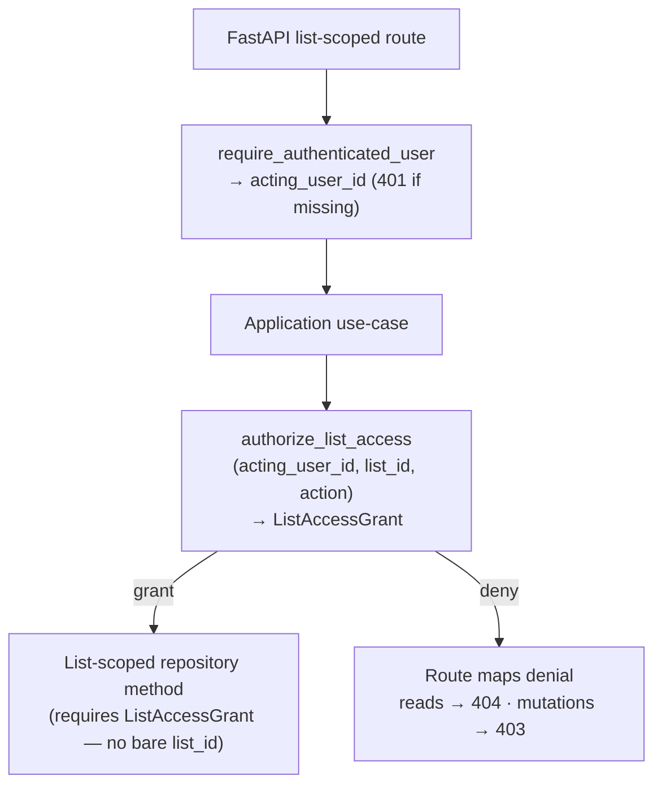

# Membership ACL enforcement sketch (living)

**Owner:** update when any story adds a list-scoped operation (same PR updates action matrix + caller map). Spine keeps a discoverability link only.  
**Story:** 1.5.4 · **Governs:** AD-19 (+ Epic 1.5 addendum) · **Practice:** proposed AD-24 (Pair 14)  
**Implements in code:** Story **2.2** (port + homepage/detail/expenses/balances + last-opened). This doc is the **contract only**.

Companion: [`auth-mail-interaction-map.md`](./auth-mail-interaction-map.md) (session ≠ Import Session).  
Story-close habit: [`story-close-overview-checklist.md`](../../../implementation-artifacts/story-close-overview-checklist.md)

---

## Overview (choke path)



**Enforcement layer:** application use-case → **one** domain ACL port. Routes authenticate and map HTTP errors; they are **not** the ACL authority. UI / `proxy.ts` are **not** a second ACL truth.

**Enumeration (homepage):** actor-scoped `list_for_user(acting_user_id)` — **does not** call `authorize_list_access` (no single `list_id`).

---

## Invariants (AD-19 + proposed AD-24 cheat sheet)

| Invariant | Rule |
|-----------|------|
| Membership | User may read/write a list’s ledger and import into it **only** with membership on that list |
| Peers | Members are peers for ordinary ledger/import reads and writes |
| Owner-only | Rename, invite, standing default-split edit |
| Product admin | **None** in v1 — no global bypass |
| Personal list | Ordinary `List` + owner membership at signup — never a separate entity type |
| One path | Single application → domain ACL port path — not ad-hoc per-route `if membership` |
| Grant | Port returns opaque **`ListAccessGrant`**; list-scoped repos require that grant only |
| Forbidden mix | Do **not** mix bare-`list_id` repos with a separate application-only check in the same use case |
| UI | No second ACL scheme in Next / `proxy.ts` (presence gate ≠ membership) |
| Auth vs Import | Auth **session** (AD-8) ≠ **Import Session** (AD-4 PDF staging) |

Proposed AD-24 is **review guidance** (Pair 14) — required practice for Epic 2. Not yet a formally renumbered spine AD unless Winston promotes it separately.

---

## Canonical port

### Signature

```text
authorize_list_access(acting_user_id, list_id, action) -> ListAccessGrant
```

- **Allow:** returns opaque `ListAccessGrant` (carry into every list-scoped repo call for that use case).
- **Deny:** raises domain errors mapped by the route (see Error / disclosure policy). Never return a “soft” grant.

### Port home (Story 2.2)

| Piece | Placement |
|-------|-----------|
| Protocol + `ListAccessGrant` type | `api/application/ports.py` (or the established application port module) |
| Policy implementation | Isolated from FastAPI and SQLAlchemy (domain/application — no route/ORM imports) |
| Invocation | Application services only |

### Action vocabulary

String (or enum) `action` values below. Ledger aliases: if both names appear in code, `read_expenses` / `write_expense` are Epic 3 endpoint aliases of `read_ledger` / `write_ledger`.

---

## Action matrix

### Member-sufficient (per-list port)

| Action | Notes |
|--------|-------|
| `read_list` | List detail shell |
| `read_expenses` | Alias of `read_ledger` at Epic 3 endpoints |
| `read_balances` | Balance stub / settle strip reads |
| `read_ledger` | Canonical ledger read |
| `write_expense` | Alias of `write_ledger` at Epic 3 endpoints |
| `write_ledger` | Canonical ledger write |
| `import_to_list` | Import into list (Epic 4+) |
| `set_last_opened_list` | Remembered list preference (member-gated **mutation**) |
| _(future)_ peer settle participation | Same port; add action when Epic 3 settle lands |

### Owner-required (per-list port)

| Action | Notes |
|--------|-------|
| `rename_list` | As-built 2.1; migrate to shared port + grant |
| `invite_member` | Story 2.3+ |
| `edit_default_split` | Story 2.5 |

### Forbidden

- Product-admin / global bypass roles
- UI-only ACL as authority
- Treating homepage enumeration as a per-list `authorize_list_access` call

---

## Enumeration vs per-list ACL

| Operation | Mechanism | Calls `authorize_list_access`? |
|-----------|-----------|--------------------------------|
| Homepage / “lists I belong to” | `list_for_user(acting_user_id)` | **No** |
| Any single-`list_id` read/write | Port → `ListAccessGrant` → repo | **Yes** |
| Create owned list | Seeds owner membership; no prior membership check | **No** (create establishes membership) |

---

## Story caller map

### 2.1 (as-built today)

| Operation | Today | Sketch stance |
|-----------|-------|---------------|
| `POST /lists` create | `CreateOwnedListService` seeds owner membership | Keep — no ACL check needed to create |
| `GET /lists` | `ListMembershipsService` → `list_for_user` | Keep actor-scoped enum pattern |
| `PATCH /lists/{id}` rename | Ad-hoc in `RenameListService`: membership + `owner_id` check; repos still take bare `list_id` | **Migration target** for shared port + `ListAccessGrant`; do **not** silently change HTTP behavior in this docs story |

### 2.2 (must implement against this contract)

| Operation | Must call |
|-----------|-----------|
| Homepage membership listing | `list_for_user(acting_user_id)` only |
| List detail | `authorize_list_access(..., read_list)` → grant → repo |
| Expenses / balances stubs | `authorize_list_access(..., read_expenses` / `read_balances)` → grant → repo |
| Set last-opened list | `authorize_list_access(..., set_last_opened_list)` → grant; denial → **403** |
| First-paint revalidation | Re-check membership for remembered `list_id` via the same port (read action) |

### Later (name only — same port, new actions as needed)

| Story / area | Actions |
|--------------|---------|
| 2.3 invite | `invite_member` (owner) |
| 2.5 default split | `edit_default_split` (owner) |
| 2.6 overrides | list-scoped writes via grant |
| Epic 3 ledger | `read_ledger` / `write_ledger` (+ expense aliases) |
| Epic 4 import | `import_to_list` |

**Living rule:** any story adding a list-scoped operation updates this sketch’s action matrix and caller map in the **same PR**.

---

## Error / disclosure policy (locked)

| Case | HTTP | Code / body |
|------|------|-------------|
| Unauthenticated | **401** | Existing session gate |
| List-scoped **reads** (detail, expenses, balances, ledger reads, any membership-gated **read** of a list resource): missing list **or** authenticated non-member | **404** | Same client-safe body (anti-enumeration). Do **not** use 403 for these reads |
| Member-gated **mutations** (incl. `set_last_opened_list`): missing/non-member | **403** | `not_list_member` (same safe denial family as 2.1 rename for non-members) |
| Authenticated member, not owner, on owner-only action | **403** | `NotListOwnerError` / owner deny code — do **not** collapse into not-found |

**Do not** silently change 2.1 rename behavior in this docs-only story (as-built remains 403 `not_list_member` for missing/non-member on rename).

---

## As-built gap → target

| Layer | Path | Role today | Target |
|-------|------|------------|--------|
| Auth gate | `api/api/deps.py` `require_authenticated_user` | Session → UUID; docstring still says “membership ACL = Epic 2” | Auth only; ACL is the next hop |
| List routes | `api/api/routes/lists.py` | Membership-filtered `GET /lists`; create; rename owner-only | Routes call services that call ACL — routes are not the ACL |
| Application | `api/application/lists.py` | Create / ad-hoc rename / enum | Rename migrates to shared port; 2.2 adds use-cases |
| Ports | `api/application/ports.py` | Email/signup ports only today | 2.2 adds `authorize_list_access` + `ListAccessGrant` |
| Repo | `ListRepository` | `get_list(list_id)`, `update_list_name(list_id, …)` bare ids | List-scoped methods require `ListAccessGrant`; enum stays `list_for_user(actor)` |
| Persistence | `adapters/persistence/…` | `role` `"owner"` \| `"member"`; `uq_list_membership` | No role/schema redesign in sketch |
| Errors | `api/domain/errors.py` | `NotListMemberError`, `NotListOwnerError`, `ListNotFoundError` | Reads → 404 (`ListNotFoundError` or equivalent same body); mutations → 403 `not_list_member`; owner deny distinct |
| UI / BFF | `ui/app/lists/*`, `ui/app/api/lists/*`, `ui/proxy.ts` | Lists BFF; proxy presence-only; `/api/lists` public at proxy | UI never becomes second ACL truth |

**Honest status:** Sketch = **target contract**. 2.1 has membership-filtered listing + ad-hoc rename checks only. **2.2 implements** the port — do not pretend compliance already exists.

---

## Test contract (owned by Story 2.2)

- Domain allow/deny TDD for the ACL port
- Postgres multi-user isolation: list enum + expenses/balances deny
- Non-member **read** → **404**
- `set_last_opened_list` non-member → **403**
- Write denial pattern reserved for later ledger stories (same port)

---

## What not to break / anti-patterns

**Preserve**

- Personal list = ordinary `List` + owner membership
- Peer members for ordinary reads/writes
- Actor-scoped homepage enum (not forced through per-list port)
- Auth session cookie path (AD-8) separate from Import Session (AD-4)
- 2.1 rename HTTP codes until an explicit policy-change story

**Do not**

- Implement the ACL port “while sketching” on the docs branch
- Per-route membership copies without the shared port
- Bare-`list_id` repos + application-only check (Pair 14)
- Homepage enum as `authorize_list_access(..., list_id=?)`
- UI / `proxy.ts` as the security boundary
- Product-admin or owner-vs-viewer roles for ordinary expense reads
- **403** on list-scoped **reads** for non-members
- **404** on `set_last_opened_list` / rename non-member without an explicit policy change story
- Confuse auth session with Import Session

---

## Related docs

| Doc | Role |
|-----|------|
| [`ARCHITECTURE-SPINE.md`](./ARCHITECTURE-SPINE.md) AD-19 | Invariant + pointer here |
| [`reviews/review-adversarial-divergence.md`](./reviews/review-adversarial-divergence.md) Pair 14 | Proposed AD-24 |
| [`2-2-lists-homepage-membership-scoped-access.md`](../../../implementation-artifacts/2-2-lists-homepage-membership-scoped-access.md) | Primary consumer |
| [`auth-mail-interaction-map.md`](./auth-mail-interaction-map.md) | Auth/session map (orthogonal) |
| [`1-5-4-membership-acl-enforcement-sketch.md`](../../../implementation-artifacts/1-5-4-membership-acl-enforcement-sketch.md) | This story file |
